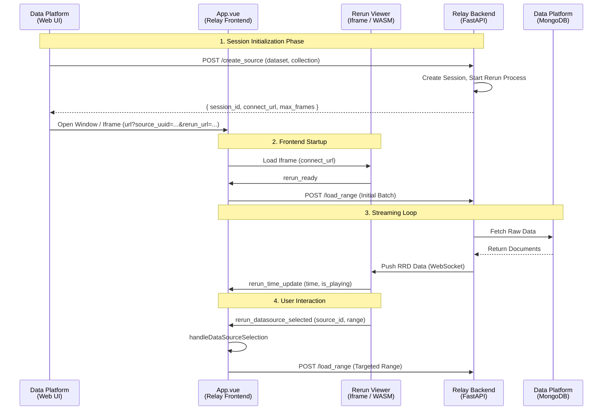

# Relay 系统架构文档

## 0. 快速开始 (Quick Start)

### 0.1 环境要求
- **Python 3.9+**
- **Node.js 16+**

### 0.2 启动步骤

#### 后端 (Backend)
```bash
cd backend
# 1. 安装依赖
pip install -r requirements.txt

# 2. 启动服务 (默认端口 9999)
# 生产环境建议通过环境变量配置 BACKEND_IP，否则默认为开发机 IP
export BACKEND_IP="127.0.0.1" 
python main.py
```

#### 前端 (Frontend)
```bash
cd frontend
# 1. 安装依赖
npm install

# 2. 启动开发服务器
npm run dev
# 或构建生产版本
# npm run build && npm run preview
```

访问 `http://localhost:5173` (Vite 默认端口) 即可进入系统。

### 0.3 关键配置详解

#### 后端配置 (`backend/app/config.py`)
主要通过环境变量控制，核心参数如下：

| 环境变量 / 变量名 | 默认值 | 作用说明 |
| :--- | :--- | :--- |
| `BACKEND_IP` | `192.168.18.104` | **重要**：Rerun Viewer 连接后端 WebSocket 的 IP 地址。**必须**是浏览器可访问的地址（如公网 IP 或局域网 IP），不能是 Docker 内部 IP。 |
| `BACKEND_PORT` | `9999` | FastAPI 服务端口。 |
| `WORKER_THREAD_MULTIPLIER` | `2` | 线程池大小系数。决定了并发处理请求的能力。 |
| `COLOR_IMG_MAX_WIDTH` | `1024` | 彩色图像压缩最大宽度。调小可显著降低带宽压力。 |
| `COLOR_IMG_QUALITY` | `50` | JPEG 压缩质量 (1-100)。越低带宽越小，但画质越差。 |
| `BATCH_BUFFER_SIZE_LIMIT` | `1MB` | 批量发送缓冲区大小。调大可提高吞吐量，但会增加延迟。 |

#### 前端配置 (`frontend/src/config.js`)
主要控制流式加载的行为和内存策略：

| 变量名 | 默认值 | 作用说明 |
| :--- | :--- | :--- |
| `STREAMING_BATCH_SIZE` | `100` | **核心**：每次向后端请求的帧数。决定了加载的粒度。 |
| `STREAMING_MEMORY_LIMIT_MB` | `1000` | 内存安全阈值。当 WASM 内存超过此值时，触发紧急 GC。 |
| `STREAMING_SAFE_WINDOW_RADIUS` | `500` | GC 时的保护半径。清理时会保留当前帧前后 N 帧的数据。 |
| `_BUFFER_COEFF` | `1.0` | 预加载系数。`1.0` 表示当剩余帧数 < BatchSize 时触发加载。 |

---

## 1. 项目概览 (Overview)

### 1.1 系统架构简述
Relay 采用 **C/S 分离** 架构，前端为基于 **Vue 3** 的单页应用 (SPA)，核心通过 `<iframe>` 嵌入深度定制的 **Rerun Viewer (WASM)**。后端基于 **FastAPI**，负责会话管理、数据流式传输及业务逻辑处理。
两者通过 **Window.postMessage** 建立双向通信桥梁，实现业务逻辑层（Vue）与可视化渲染层（Rerun）的解耦与协同，形成“控制平面”与“渲染平面”分离的现代可视化架构。

### 1.2 启动与鉴权流程 (Session Handshake)
系统采用“预先申请，带参启动”的会话模式，确保在页面加载前资源已就绪。

1.  **Session 申请**: 
    在进入可视化页面前（通常由调度系统或入口页发起），向后端 `/create_source` 接口发起请求。
    *   **接口**: `POST /create_source`
    *   **关键响应参数**:
        *   `recording_uuid`: 全局唯一的会话 ID，作为后续所有 HTTP/WebSocket 交互的凭证。
        *   `connect_url`: Rerun Viewer 连接后端的 WebSocket 地址 (如 `rerun+http://127.0.0.1:9999/proxy`)。
        *   `max_frame_idx`: 数据集的总帧数，用于初始化前端进度条范围。
        *   `app_id`: 应用标识 ID。

2.  **前端初始化**:
    *   获得的 `recording_uuid` 和 `rerun_url` (即 `connect_url`) 通过 URL Query Parameters 传递给 Vue 前端 (例如 `?source_uuid=...&rerun_url=...`)。
    *   Vue 在 `setup` 生命周期解析 URL 参数，初始化 Pinia Store，并根据 `recording_uuid` 启动心跳保活与流式加载任务。

### 1.3 数据控制平面 (Data Control Plane)
前端 `App.vue` 充当**控制平面**，通过 **PostMessage 协议** 与 Rerun Viewer (数据平面) 进行高频交互，实现对播放与内存的精准闭环管理：

#### **交互时序图 (Message Flow)**

![Sequence Diagram](https://mermaid.ink/img/eyJjb2RlIjogInNlcXVlbmNlRGlhZ3JhbVxuICAgIHBhcnRpY2lwYW50IERQX1dlYiBhcyBEYXRhIFBsYXRmb3JtPGJyLz4oV2ViIFVJKVxuICAgIHBhcnRpY2lwYW50IFZ1ZSBhcyBBcHAudnVlPGJyLz4oUmVsYXkgRnJvbnRlbmQpXG4gICAgcGFydGljaXBhbnQgUmVydW4gYXMgUmVydW4gVmlld2VyPGJyLz4oSWZyYW1lIC8gV0FTTSlcbiAgICBwYXJ0aWNpcGFudCBSZWxheV9CRSBhcyBSZWxheSBCYWNrZW5kPGJyLz4oRmFzdEFQSSlcbiAgICBwYXJ0aWNpcGFudCBEUF9EQiBhcyBEYXRhIFBsYXRmb3JtPGJyLz4oTW9uZ29EQilcblxuICAgIE5vdGUgb3ZlciBEUF9XZWIsIFJlbGF5X0JFOiAxLiBTZXNzaW9uIEluaXRpYWxpemF0aW9uIFBoYXNlXG4gICAgRFBfV2ViLT4-UmVsYXlfQkU6IFBPU1QgL2NyZWF0ZV9zb3VyY2UgKGRhdGFzZXQsIGNvbGxlY3Rpb24pXG4gICAgUmVsYXlfQkUtPj5SZWxheV9CRTogQ3JlYXRlIFNlc3Npb24sIFN0YXJ0IFJlcnVuIFByb2Nlc3NcbiAgICBSZWxheV9CRS0tPj5EUF9XZWI6IHsgc2Vzc2lvbl9pZCwgY29ubmVjdF91cmwsIG1heF9mcmFtZXMgfVxuICAgIFxuICAgIERQX1dlYi0-PlZ1ZTogT3BlbiBXaW5kb3cgLyBJZnJhbWUgKHVybD9zb3VyY2VfdXVpZD0uLi4mcmVydW5fdXJsPS4uLilcbiAgICBcbiAgICBOb3RlIG92ZXIgVnVlLCBSZXJ1bjogMi4gRnJvbnRlbmQgU3RhcnR1cFxuICAgIFZ1ZS0-PlJlcnVuOiBMb2FkIElmcmFtZSAoY29ubmVjdF91cmwpXG4gICAgUmVydW4tPj5WdWU6IHJlcnVuX3JlYWR5XG4gICAgVnVlLT4-UmVsYXlfQkU6IFBPU1QgL2xvYWRfcmFuZ2UgKEluaXRpYWwgQmF0Y2gpXG4gICAgXG4gICAgTm90ZSBvdmVyIFZ1ZSwgRFBfREI6IDMuIFN0cmVhbWluZyBMb29wXG4gICAgUmVsYXlfQkUtPj5EUF9EQjogRmV0Y2ggUmF3IERhdGFcbiAgICBEUF9EQi0tPj5SZWxheV9CRTogUmV0dXJuIERvY3VtZW50c1xuICAgIFJlbGF5X0JFLT4-UmVydW46IFB1c2ggUlJEIERhdGEgKFdlYlNvY2tldClcbiAgICBSZXJ1bi0-PlZ1ZTogcmVydW5fdGltZV91cGRhdGUgKHRpbWUsIGlzX3BsYXlpbmcpXG4gICAgXG4gICAgTm90ZSBvdmVyIFZ1ZSwgUmVydW46IDQuIFVzZXIgSW50ZXJhY3Rpb25cbiAgICBSZXJ1bi0-PlZ1ZTogcmVydW5fZGF0YXNvdXJjZV9zZWxlY3RlZCAoc291cmNlX2lkLCByYW5nZSlcbiAgICBWdWUtPj5WdWU6IGhhbmRsZURhdGFTb3VyY2VTZWxlY3Rpb25cbiAgICBWdWUtPj5SZWxheV9CRTogUE9TVCAvbG9hZF9yYW5nZSAoVGFyZ2V0ZWQgUmFuZ2UpIiwgIm1lcm1haWQiOiB7InRoZW1lIjogImRlZmF1bHQifX0=)

<details>
<summary>点击查看 Mermaid 源码</summary>


</details>

#### **入站事件流 (Viewer -> Vue)**
前端监听以下核心消息以感知 Viewer 状态：

*   **`rerun_ready`**
    *   **来源**: Rerun Viewer (Lifecycle)
    *   **用途**: 握手信号。表明 WASM 运行时加载完成，Vue 随即启动数据预加载与心跳。
    
*   **`rerun_time_update`**
    *   **来源**: Rerun Viewer (Playback Controller)
    *   **用途**: 实时心跳。包含当前 `time` (帧索引) 和 `is_playing` 状态。Vue 基于此计算剩余 Buffer，智能触发 `load_range` 预加载下一块数据。
    *   **逻辑**: 同时用于检测“自动模式恢复”，即当用户手动跳转出选区后，自动切回流式加载模式。

*   **`rerun_memory_usage`**
    *   **来源**: Rerun Viewer (Memory Monitor)
    *   **用途**: 内存遥测。周期性汇报 WASM 堆内存占用（Bytes）。
    *   **逻辑**: 
        1. 更新 UI 内存显示。
        2. 作为 **自动 GC (Auto GC)** 的触发器（当 > Limit 时）。
        3. 释放 `checkMemoryAndGC` 的同步锁，允许后续操作继续。

*   **`rerun_datasource_selected`**
    *   **来源**: Rerun Viewer (Interaction)
    *   **用途**: 用户在 3D 视图中框选对象时触发，携带 `start_time` 和 `end_time`。
    *   **逻辑**: 触发 `handleDataSourceSelection`，暂停后台自动加载，等待 GC 完成，然后跳转并锁定播放区间。

*   **`RERUN_RATING_COMPLETE`**
    *   **来源**: Rerun Viewer (Rating Plugin)
    *   **用途**: 用户完成标注/打分后触发。
    *   **逻辑**: 前端收到后调用后端 API 同步评分数据，并弹出成功通知。

*   **`rerun_row_count_report`**
    *   **来源**: Rerun Viewer (Debug)
    *   **用途**: 报告内部数据行数，主要用于验证 GC 是否生效（数据行数是否减少）。

#### **出站指令集 (Vue -> Viewer)**
前端根据业务逻辑向 Viewer 下发控制指令：
*   **`rerun_set_time`**: 强制同步时间轴（用于切片跳转、回放控制）。
*   **`rerun_set_loop_selection`**: 设定循环播放区间，限制 Viewer 在特定时间段内循环渲染。
*   **`rerun_force_gc_everything`**: 内存熔断指令。当监测到内存超标时，Vue 计算当前可视窗口（Safe Window），构造 `protected_time_ranges` 并发送此指令，强制 Viewer 释放非保护区的所有显存与堆内存。

### 1.4 技术栈清单 (Tech Stack)

| 层级 | 技术组件 | 用途 |
| :--- | :--- | :--- |
| **Frontend** | **Vue 3** (Composition API) | 核心 UI 框架，负责状态管理与逻辑编排 |
| | **Vite** | 前端构建工具 |
| | **Pinia** | 全局状态管理 (User/Session Info) |
| | **Rerun Viewer (WASM)** | 嵌入式可视化引擎，通过 iframe 运行 |
| **Backend** | **FastAPI** | 高性能异步 Web 框架 |
| | **Rerun SDK (Python)** | 数据日志记录与传输 |
| | **Pandas / NumPy** | 数据处理与计算 |
| **Infra** | **Docker** (Implied) | 容器化部署 |

### 1.2 核心目录结构

```text
Relay/
├── backend/                  # Python 后端
│   ├── app/
│   │   ├── api/              # REST 接口路由 (Session, Rating)
│   │   ├── core.py           # SessionManager 核心会话管理
│   │   ├── service/          # 业务逻辑层 (Service Layer)
│   │   └── processors/       # 数据转换器 (将原始数据转为 Rerun 格式)
│   └── main.py               # FastAPI 入口
├── frontend/                 # Vue 3 前端
│   ├── public/rerun-viewer/  # 本地部署的 Rerun Viewer 静态资源
│   ├── src/
│   │   ├── App.vue           # [核心] 负责流式加载、内存监控、Iframe 通信
│   │   ├── config.js         # 全局配置 (内存阈值、Batch Size)
│   │   └── components/       # UI 组件 (RerunViewer.vue, FloatingButton.vue)
│   └── vite.config.js
```

---

## 2. 系统架构 (Architecture)

### 2.1 整体架构逻辑

系统采用 **C/S 分离** + **Iframe 桥接** 的混合架构。

![Architecture Diagram](https://mermaid.ink/img/eyJjb2RlIjogImdyYXBoIFREXG4gICAgc3ViZ3JhcGggQ2xpZW50IFtGcm9udGVuZCAoQnJvd3NlcildXG4gICAgICAgIFZ1ZVtBcHAudnVlPGJyLz4oQ29udHJvbCBQbGFuZSldXG4gICAgICAgIFZpZXdlcltSZXJ1biBWaWV3ZXI8YnIvPihJZnJhbWUgLyBXQVNNKV1cbiAgICBlbmRcblxuICAgIHN1YmdyYXBoIEJhY2tlbmQgW0JhY2tlbmQgU2VydmVyXVxuICAgICAgICBBUElbQVBJIExheWVyPGJyLz4oYXBpL3Nlc3Npb24ucHkpXVxuICAgICAgICBTZXNzaW9uW1Nlc3Npb24gTWFuYWdlcjxici8-KGNvcmUucHkpXVxuICAgICAgICBEYXRhUHJvdmlkZXJbRGF0YSBQcm92aWRlcjxici8-KGRhdGFfcHJvdmlkZXIucHkpXVxuICAgIGVuZFxuXG4gICAgc3ViZ3JhcGggRGF0YUluZnJhIFtEYXRhIEluZnJhc3RydWN0dXJlXVxuICAgICAgICBNb25nb0RCWyhEYXRhIFBsYXRmb3JtPGJyLz5Nb25nb0RCKV1cbiAgICBlbmRcblxuICAgICUlIENvbnRyb2wgRmxvd1xuICAgIFZ1ZSAtLSAnMS4gSFRUUCBQT1NUIC9sb2FkX3JhbmdlJyAtLT4gQVBJXG4gICAgQVBJIC0tICcyLiBzZXNzaW9uLmxvYWRfcmFuZ2UoKScgLS0-IFNlc3Npb25cbiAgICBTZXNzaW9uIC0tICczLiBEYXRhTWFuYWdlci5mZXRjaF9mcmFtZXMoKScgLS0-IERhdGFQcm92aWRlclxuICAgIFxuICAgICUlIERhdGEgQWNjZXNzIEZsb3dcbiAgICBEYXRhUHJvdmlkZXIgLS0gJzQuIERhdGFDbGllbnQuZmluZCgpJyAtLT4gTW9uZ29EQlxuICAgIE1vbmdvREIgLS0gJzUuIFJhdyBCU09OL0pTT04nIC0tPiBEYXRhUHJvdmlkZXJcbiAgICBEYXRhUHJvdmlkZXIgLS0gJzYuIFlpZWxkIEZyYW1lcycgLS0-IFNlc3Npb25cbiAgICBcbiAgICAlJSBSZXJ1biBTdHJlYW1pbmcgRmxvd1xuICAgIFNlc3Npb24gLS0gJzcuIHJyLmxvZygpIC0-IFRDUC9XUycgLS0-IFZpZXdlclxuICAgIFxuICAgICUlIEZyb250ZW5kIEludGVybmFsXG4gICAgVmlld2VyIC0uICc4LiBwb3N0TWVzc2FnZSAoQWNrL1JlbmRlciknIC4tPiBWdWUiLCAibWVybWFpZCI6IHsidGhlbWUiOiAiZGVmYXVsdCJ9fQ==)

<details>
<summary>点击查看 Mermaid 源码</summary>

```mermaid
graph TD
    subgraph Client [Frontend (Browser)]
        Vue[App.vue<br/>(Control Plane)]
        Viewer[Rerun Viewer<br/>(Iframe / WASM)]
    end

    subgraph Backend [Backend Server]
        API[API Layer<br/>(api/session.py)]
        Session[Session Manager<br/>(core.py)]
        DataProvider[Data Provider<br/>(data_provider.py)]
    end

    subgraph DataInfra [Data Infrastructure]
        MongoDB[(Data Platform<br/>MongoDB)]
    end

    %% Control Flow
    Vue -- '1. HTTP POST /load_range' --> API
    API -- '2. session.load_range()' --> Session
    Session -- '3. DataManager.fetch_frames()' --> DataProvider
    
    %% Data Access Flow
    DataProvider -- '4. DataClient.find()' --> MongoDB
    MongoDB -- '5. Raw BSON/JSON' --> DataProvider
    DataProvider -- '6. Yield Frames' --> Session
    
    %% Rerun Streaming Flow
    Session -- '7. rr.log() -> TCP/WS' --> Viewer
    
    %% Frontend Internal
    Viewer -. '8. postMessage (Ack/Render)' .-> Vue
```
</details>

1.  **控制流 (Control Plane)**: 前端通过 HTTP REST API 向后端发送指令（如“加载第 100-200 帧”、“创建会话”）。
2.  **数据流 (Data Plane)**: 后端通过 Rerun SDK (TCP/WebSocket) 直接向嵌入在前端 iframe 中的 Rerun Viewer 推送二进制数据流。
3.  **数据获取**: 后端 `DataManager` 通过 `DataClient` 从 MongoDB 数据平台获取原始数据，经由 `Processors` 处理后推送到流中。

### 2.2 核心交互机制

*   **Iframe 通信 (Window.postMessage)**:
    *   **Frontend -> Viewer**: 发送时间轴跳转 (`rerun_set_time`)、循环选区设置 (`rerun_set_loop_selection`)、强制 GC 指令。
    *   **Viewer -> Frontend**: 汇报当前播放时间 (`rerun_time_update`)、内存占用 (`rerun_memory_usage`)。
*   **流式加载 (Streaming Loop)**:
    *   前端监听播放进度 -> 计算剩余 buffer -> 触发 `load_range` API -> 后端读取数据 -> 推送至 Viewer -> Viewer 渲染。
*   **心跳保活 (Heartbeat)**:
    *   前端每 60s 发送一次心跳，防止后端回收空闲的 Session 资源。

---

## 3. 核心组件/模块解析 (Core Components)

### 3.1 Frontend Orchestrator (`App.vue`)
**职责**: 整个应用的“大脑”，负责协调 UI、数据加载和内存安全。
*   **关键逻辑**:
    *   `onTimeUpdate`: 监听播放，判断是否需要预加载下一块数据（Buffer 策略）。
    *   `handleDataSourceSelection`: **同步化**的数据源切换逻辑（Wait GC -> Load Data）。
    *   `performEmergencyCleanup`: 当 WASM 内存超标时，计算保留窗口，强制丢弃旧数据。
    *   `checkMemoryAndGC`: 基于 Promise 的内存检查锁，防止并发加载导致的数据竞争。

### 3.2 Backend Session Manager (`backend/app/core.py`)
**职责**: 维护多用户/多标签页的独立会话状态。
*   **关键逻辑**:
    *   `sessions (Dict)`: 内存中存储 `uuid -> Session` 的映射。
    *   `create_session`: 初始化 Rerun 实例，分配端口。
    *   `prune_sessions`: 定时清理无心跳的过期会话。

### 3.3 Data Processors (`backend/app/processors/`)
**职责**: 将异构数据源（数据库、文件）转换为 Rerun 可识别的日志实体。
*   **典型实现**: `LidarProcessor`, `ImageProcessor`。
*   **流程**: `Load Raw Data` -> `NumPy Transform` -> `rerun.log()`.

---

## 4. 接口文档 (API Reference)

### 4.1 Session Management (`/api/session`)

#### `POST /create_source`
初始化一个新的可视化会话。
*   **Request**: `{ dataset, collection, streaming_mode: true }`
*   **Response**: `{ recording_uuid, connect_url, max_frame_idx }`
*   **Logic**: 后端启动 Rerun 进程，准备接收数据，但不立即加载全量数据。

#### `POST /load_range/{uuid}`
核心流式接口，请求加载特定时间段的数据。
*   **Request**: `{ start_index: 100, end_index: 200 }`
*   **Logic**:
    1.  锁定 Session。
    2.  调用 Processors 读取 [100, 200) 帧的数据。
    3.  通过 Rerun SDK 推送数据。
    4.  **注意**: 这是一个异步操作，HTTP 响应仅代表“请求已接收”，数据到达 Viewer 会有延迟。

### 4.2 Utility (`/api/utils`)

#### `POST /heartbeat/{uuid}`
*   **Logic**: 刷新 Session 的 `last_active_time`，防止被 GC。

#### `POST /clear_queues/{uuid}`
*   **Logic**: 在执行紧急 GC 或跳转前，清空后端积压的发送队列，防止旧数据污染新场景。

---

## 5. 开发者指南 (Developer Notes)

### 5.1 关键配置 (`frontend/src/config.js`)
*   `STREAMING_BATCH_SIZE`: 默认 **100**。决定了每次向后端请求多少帧。过大导致加载卡顿，过小导致网络开销大。
*   `STREAMING_MEMORY_LIMIT_MB`: 默认 **1000MB**。浏览器单 Tab 内存有限，超过此值会触发强制数据裁剪。

### 5.2 竞态条件 (Race Conditions)
在开发时需特别注意 **GC 与 加载** 的冲突。
*   **规则**: 永远不要在 `performEmergencyCleanup` 执行期间触发 `load_range`。
*   **机制**: 使用 `isCleaningUp` 标志位和 `waitForCleanup()` 辅助函数来串行化这两个操作。

### 5.3 调试技巧
*   前端开启 **Debug Mode** (URL 参数控制或非 Prod 环境) 可看到内存仪表盘。
*   使用 `isSourceSwitching` 状态来屏蔽跳转过程中的自动模式误判。
