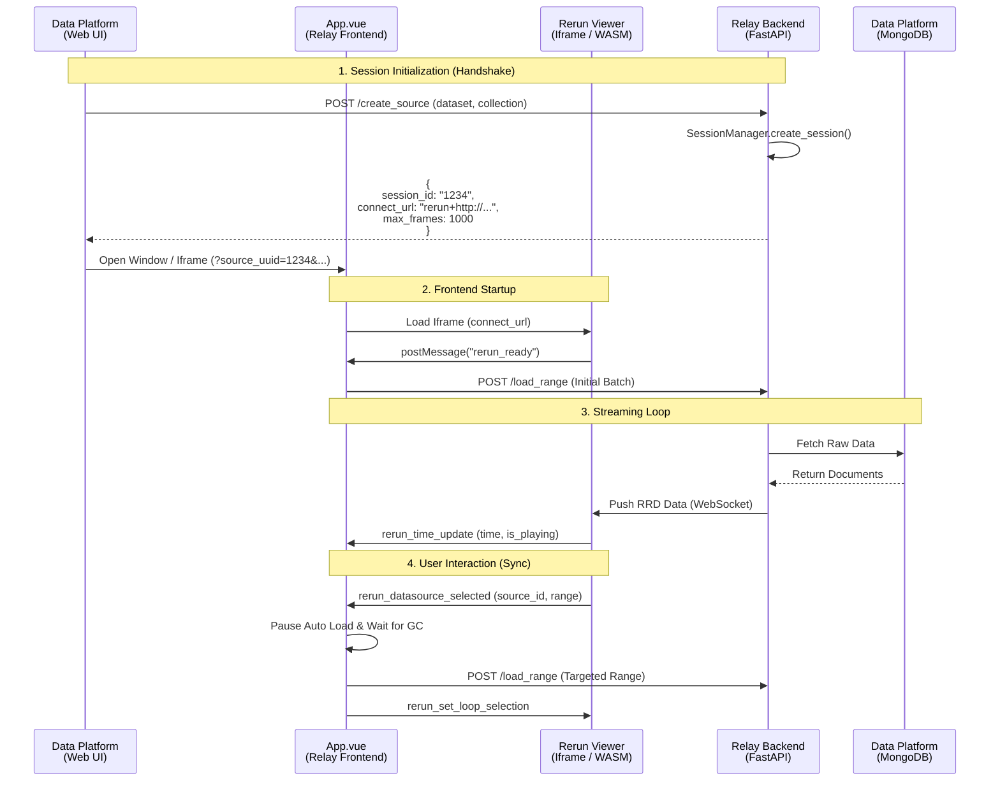

# Relay 可视化系统技术文档

Relay 是一个基于 **Vue 3** 和 **Rerun** 构建的高性能、C/S 分离的 3D 可视化系统。它通过 Iframe 桥接技术，将 Web 前端的灵活交互与 WASM 的高性能渲染能力结合，实现了对大规模时序数据的流式加载与实时回放。

---

## 📚 目录 (Table of Contents)

1.  [快速开始 (Quick Start)](#1-快速开始-quick-start)
2.  [系统架构 (System Architecture)](#2-系统架构-system-architecture)
3.  [会话生命周期 (Session Lifecycle)](#3-会话生命周期-session-lifecycle)
4.  [前端控制平面 (Control Plane - App.vue)](#4-前端控制平面-control-plane---appvue)
5.  [通信协议 (Communication Protocol)](#5-通信协议-communication-protocol)
6.  [后端数据平面 (Data Plane)](#6-后端数据平面-data-plane)
7.  [API 参考 (API Reference)](#7-api-参考-api-reference)

---

## 1. 快速开始 (Quick Start)

### 1.1 环境要求
*   **Node.js**: v18+
*   **Python**: 3.8+
*   **MongoDB**: 需配置可访问的 MongoDB 实例 (配置位于 `backend/app/data_provider.py`)

### 1.2 部署步骤

#### 后端服务 (Backend)
```bash
cd backend
# 安装依赖
pip install -r requirements.txt
# 启动服务 (默认端口 9999)
python main.py
```

#### 前端应用 (Frontend)
```bash
cd frontend
# 安装依赖
npm install
# 启动开发服务器 (默认端口 9998)
npm run dev
```

### 1.3 关键配置说明

Relay 的配置分布在后端 Python 文件和前端的环境变量中。部署前请务必检查以下配置。

#### A. 后端配置 (`backend/app/config.py`)

主要控制服务监听地址、性能调优和图像压缩参数。可以通过环境变量覆盖默认值。

**网络与基础配置**
| 参数项 | 默认值 | 说明 |
| :--- | :--- | :--- |
| `BACKEND_IP` | `192.168.18.104` | 后端服务绑定的 IP 地址。 |
| `BACKEND_PORT` | `9999` | 后端 API 服务端口。 |
| `DEFAULT_DB` | `db_prod` | 默认连接的 MongoDB 数据库名。 |
| `DEFAULT_COL` | `db_dev` | 默认连接的集合名。 |

**性能调优 (Performance Tuning)**
| 参数项 | 默认值 | 说明 |
| :--- | :--- | :--- |
| `WORKER_THREAD_MULTIPLIER` | `2` | 数据加载线程池大小系数 (CPU核心数 * 此系数)。 |
| `BACKPRESSURE_QUEUE_MULTIPLIER` | `4` | 背压队列大小系数 (工作线程数 * 此系数)。控制内存中等待发送的数据块数量。 |
| `SENDER_THREAD_COUNT` | `4` | 异步数据发送（如图像、点云）的并发线程数。 |
| `SCAN_THREAD_COUNT` | `CPU*2` | 数据源扫描（IO 密集型任务）的并发线程数。 |
| `SLIDING_WINDOW_CACHE_SIZE` | `300` | 后端滑动窗口缓存大小（帧数），用于加速频繁访问的数据段。 |

**数据传输与压缩 (Data Transmission)**
| 参数项 | 默认值 | 说明 |
| :--- | :--- | :--- |
| `BATCH_BUFFER_SIZE_LIMIT` | `1048576` (1MB) | 批量发送缓冲区大小限制 (Bytes)。 |
| `BATCH_BUFFER_TIMEOUT` | `0.05` (50ms) | 批量发送缓冲区刷新超时时间。 |
| `COLOR_IMG_MAX_WIDTH` | `1024` | 彩色图像最大宽度 (用于压缩传输)。 |
| `COLOR_IMG_QUALITY` | `50` | JPEG 压缩质量 (1-100)。 |
| `DEPTH_IMG_MAX_WIDTH` | `640` | 深度图像最大宽度。 |
| `DEPTH_IMG_COMPRESS` | `False` | 是否开启深度图压缩 (True/False)。 |

#### B. 前端环境配置 (`frontend/.env.*`)

前端通过 Vite 环境变量控制 API 连接和运行模式。

**`.env.development` (开发环境示例)**
```ini
VITE_PORT=9998                  # 前端开发服务器端口
VITE_API_BASE_URL=http://101.6.69.214:9999    # 后端 API 地址
VITE_RERUN_VIEWER_BASE=http://101.6.69.214:9092/ # Rerun Viewer 服务地址
VITE_RERUN_STREAMING_MODE=true  # 开启流式加载模式
```

**`.env.production` (生产环境示例)**
```ini
VITE_PORT=9998
VITE_API_BASE_URL=http://101.6.69.214:9999
VITE_RERUN_VIEWER_BASE=http://101.6.69.214:9092/
VITE_RERUN_STREAMING_MODE=true
```

#### C. 前端运行时配置 (`frontend/src/config.js`)

包含核心的流式加载策略和内存管理参数。

| 配置对象 | 参数项 | 默认值 | 说明 |
| :--- | :--- | :--- | :--- |
| `RERUN_CONFIG` | `STREAMING_MEMORY_LIMIT_MB` | `1000` | 前端内存阈值 (MB)。超过此值将触发紧急 GC 和数据清理。 |
| | `STREAMING_BATCH_SIZE` | `100` | 单次向后端请求的帧数 (Batch Size)。 |
| | `STREAMING_SAFE_WINDOW_RADIUS` | `500` | GC 时保留的“安全窗口”半径 (帧数)。即当前播放时间点前后的数据不会被清理。 |
| | `_BUFFER_COEFF` | `1.0` | 播放时的预加载触发系数 (Batch Size * Coeff)。 |
| | `_PAUSED_BUFFER_COEFF` | `1.0` | 暂停时的预加载触发系数。 |

---

## 2. 系统架构 (System Architecture)

Relay 采用 **双平面架构 (Dual-Plane Architecture)**：
*   **控制平面 (Control Plane)**: `App.vue` (Vue 3)。负责业务逻辑、状态同步、用户交互响应。
*   **渲染平面 (Render Plane)**: `Rerun Viewer` (WASM)。运行在 Iframe 中，专注于 3D 点云/图像的高性能渲染。
*   **数据平面 (Data Plane)**: Python Backend。负责数据清洗、格式转换 (`processors/`) 和流式推送 (`rr.log`).

### 架构图 (Architecture Diagram)


<details>
<summary>查看 Mermaid 源码</summary>

```mermaid
graph TD
    subgraph Client [Frontend (Browser)]
        Vue[App.vue<br/>(Control Plane)]
        Viewer[Rerun Viewer<br/>(Iframe / WASM)]
    end

    subgraph Backend [Backend Server]
        API[API Layer<br/>(api/session.py)]
        Session[Session Manager<br/>(core.py)]
        DataProvider[Data Provider<br/>(data_provider.py)]
    end

    subgraph DataInfra [Data Infrastructure]
        MongoDB[(Data Platform<br/>MongoDB)]
    end

    %% Control Flow
    Vue -- '1. HTTP POST /load_range' --> API
    API -- '2. session.load_range()' --> Session
    Session -- '3. DataManager.fetch_frames()' --> DataProvider
    
    %% Data Access Flow
    DataProvider -- '4. DataClient.find()' --> MongoDB
    MongoDB -- '5. Raw BSON/JSON' --> DataProvider
    DataProvider -- '6. Yield Frames' --> Session
    
    %% Rerun Streaming Flow
    Session -- '7. rr.log() -> TCP/WS' --> Viewer
    
    %% Frontend Internal
    Viewer -. '8. postMessage (Ack/Render)' .-> Vue
```
</details>

---

## 3. 会话生命周期 (Session Lifecycle)

Relay 的核心流程包括：**会话握手** -> **流式加载** -> **交互响应**。

### 3.1 完整时序图 (Sequence Diagram)


<details>
<summary>查看 Mermaid 源码</summary>


</details>

---

## 4. 前端控制平面 (Control Plane - App.vue)

`App.vue` 是系统的核心调度器，其逻辑复杂性主要体现在**异步同步**与**状态管理**。

### 4.1 核心状态机 (State Machine)

| 状态变量 | 类型 | 作用 | 转换条件 |
| :--- | :--- | :--- | :--- |
| `isUserInteracting` | `Boolean` | **模式切换**。`true` 为用户交互模式，`false` 为自动流式加载模式。 | 用户点击 DataSource -> `true`；用户点击空白处 -> `false`。 |
| `isSourceSwitching` | `Boolean` | **跳转保护**。防止在跳转时间轴时触发“越界自动加载”。 | 开始跳转 -> `true`；Viewer 时间更新确认 -> `false`。 |
| `isCleaningUp` | `Boolean` | **GC 锁**。防止在 GC 过程中发起新的数据请求。 | 内存阈值触发 -> `true`；`rerun_memory_usage` 下降 -> `false`。 |

### 4.2 关键逻辑：交互同步 (Interaction Sync)

当用户在 3D 视图中点击某个物体时，系统必须保证在加载该物体详细数据前，内存已清理且队列已清空。

```javascript
// 代码逻辑简化示意
const handleDataSourceSelection = async (source_id, start, end) => {
    // 1. 进入交互模式，暂停背景加载
    isUserInteracting.value = true;
    
    // 2. 内存安全检查 (Promise-based Lock)
    // 等待当前的 GC 周期完成，防止数据竞争
    await checkMemoryAndGC(); 
    if (isCleaningUp.value) await waitForCleanup();
    
    // 3. 清理后端队列，防止旧数据污染
    await clearBackendQueues();
    
    // 4. 加载目标数据并锁定播放区间
    await handleLoadRange(start, end);
    setLoopSelection(start, end);
};
```

---

## 5. 通信协议 (Communication Protocol)

前端与 Rerun Viewer 通过 `window.postMessage` 进行双向通信。

### 5.1 Viewer -> Vue (Events)

| 消息类型 (type) | 触发时机 | 携带数据 | 前端响应逻辑 |
| :--- | :--- | :--- | :--- |
| `rerun_ready` | WASM 初始化完成 | - | 启动首批数据加载。 |
| `rerun_time_update` | 播放时间变化 | `time`, `is_playing` | 检查 Buffer 是否不足；如果在自动模式且 Buffer 低，触发预加载。 |
| `rerun_memory_usage` | 周期性上报 (1Hz) | `usage` (bytes) | 更新 UI；若 `> 3.5GB`，触发 `performEmergencyCleanup`。 |
| `rerun_datasource_selected` | 用户点击 3D 对象 | `source_id`, `range` | 进入交互模式，加载该对象的全量数据。 |
| `rerun_row_count_report` | 调试 | `count` | 验证 GC 是否生效。 |

### 5.2 Vue -> Viewer (Commands)

| 指令类型 (type) | 参数 | 作用 |
| :--- | :--- | :--- |
| `rerun_set_time` | `time` | 强制跳转时间轴。 |
| `rerun_set_loop_selection` | `start`, `end` | 设定循环播放区间 (Loop)。 |
| `rerun_force_gc_everything` | `protected_time_ranges` | **强制 GC**。除了保护的时间段外，清除所有显存和堆内存数据。 |

---

## 6. 后端数据平面 (Data Plane)

### 6.1 Session Manager (`core.py`)
*   **多租户隔离**: 维护全局 `sessions` 字典，Key 为 UUID。
*   **端口池**: 动态管理 9000-9100 端口，每个 Session 独占一个 WebSocket 端口。
*   **保活机制**: 定时清理无心跳的 Session。

### 6.2 Data Flow
1.  **Request**: 接收前端 `load_range(start, end)` 请求。
2.  **Fetch**: `DataProvider` 从 MongoDB 读取 BSON 数据。
3.  **Process**: `Processors` 将 BSON 转换为 Rerun 的 `rr.log` 调用。
4.  **Push**: Rerun SDK 通过 TCP/WebSocket 将二进制流推送到前端 WASM。

---

## 7. API 参考 (API Reference)

### Session API

| Method | Endpoint | Description | Payload |
| :--- | :--- | :--- | :--- |
| `POST` | `/api/session/create_source` | 创建会话 | `{ dataset_id, collection_id }` |
| `POST` | `/api/session/load_range` | 加载数据片段 | `{ session_id, start_frame, count }` |
| `POST` | `/api/session/clear_queues` | 清空发送队列 | `{ session_id }` |
| `POST` | `/api/session/close` | 关闭会话 | `{ session_id }` |

### Rating API

| Method | Endpoint | Description | Payload |
| :--- | :--- | :--- | :--- |
| `POST` | `/api/rating/submit` | 提交标注结果 | `{ session_id, rating, comments }` |

---

*文档版本: v1.2 | 更新时间: 2026-02-04*
